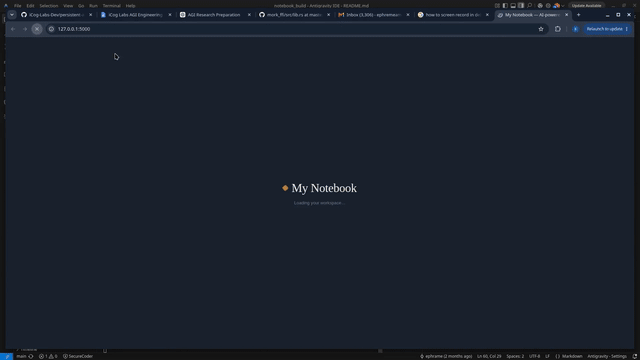

# My-Notebook — a notebook for your documents

A self-hosted, NotebookLM-style RAG app: drop in PDFs/text files, chat with
them, and get answers with clickable numbered citations that jump to the
exact source passage. Generate audio overviews of your documents — as a
two-host podcast or a single-narrator summary — powered by Edge-TTS. Hybrid
retrieval (semantic + keyword) under the hood, fully visible and editable.

## What makes this different from a toy RAG demo

- **Multiple sources per notebook** — not one document at a time.
- **Real conversation** — multi-turn chat with history, not single Q&A.
- **Citations, not just "here are some chunks"** — the model is prompted to
  cite `[1]`, `[2]`... and the UI turns those into clickable chips that
  scroll to and highlight the exact passage they came from, with its
  semantic/keyword/fused scores visible.
- **Source management** — see every indexed document with its chunk count,
  remove one without rebuilding the whole notebook.
- **Audio overviews** — generate a two-host podcast discussion or a
  single-narrator summary of your notebook, synthesised with Edge-TTS.
  Listen directly in the browser.
- **A real interface** — three-pane layout (sources / chat / source
  inspector), not a single form.

## Architecture

```
core/
  chunking.py       recursive character splitter (hand-written, tunable)
  embeddings.py      local sentence-transformer embeddings
  bm25.py            keyword search, from-scratch inverted index + BM25
  vectorstore.py     ChromaDB wrapper: storage, dense search, source grouping/deletion
  retriever.py       fuses dense + sparse scores (tunable alpha)
  chat_history.py    short rolling conversation memory per notebook
  rag_pipeline.py    ingestion + citation-aware prompt building + LLM call
  audio_generator.py script generation (LLM) + Edge-TTS synthesis + MP3 concat
app.py               Flask routes (sources, chat, audio, notebooks)
templates/index.html three-pane UI: sources rail / chat / citation inspector
```

## Setup

```bash
python -m venv venv
source venv/bin/activate        # Windows: venv\Scripts\activate
pip install -r requirements.txt

cp .env.example .env
# edit .env and add your GEMINI_API_KEY (https://aistudio.google.com/apikey)

python app.py
# open http://localhost:5000
```

## Run with Docker

```bash
cp .env.example .env   
docker compose up --build
# open http://localhost:5000
```

## Test

```bash
python app.py            # in one terminal
python test_app.py       # in another
```

## Demo

[](static/demo.mp4)

- 🎬 **[Watch Demo Video (MP4)](static/demo.mp4)**
- 🎧 **[Listen to Sample Audio Overview (MP3)](static/audio_generated.mp3)**


